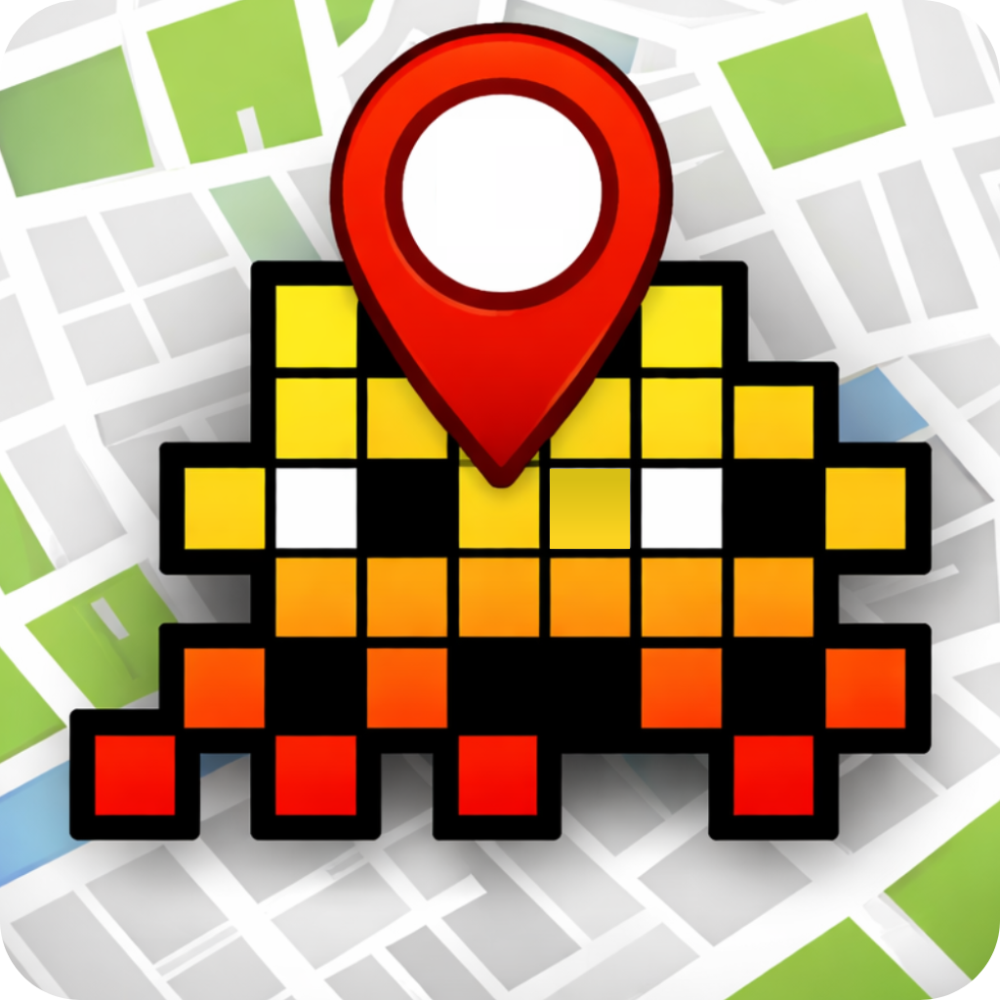

<div align="center">

<h1>Geo Invaders</h1>
</div>

> [!IMPORTANT]  
> Right now, the project is in beta. If you find bugs, don't hesitate to fix them and contribute to the project if you know how!

An interactive web application for exploring and tracking Flash Invaders street art across the globe.

Built with Next.js and MapTiler, this app helps you discover, locate, and navigate to Space Invader mosaics in your city.

## ✨ Features

- **Interactive Map** - Explore Flash Invaders locations worldwide with a smooth, responsive map interface
- **Real-time Geolocation** - Track your position and find nearby invaders
- **Smart Navigation** - Get directions to any invader location
- **Search & Filter** - Find specific invaders or browse by area
- **Mobile Responsive** - Optimized for both desktop and mobile devices
- **Fast Performance** - Static site generation for lightning-fast loading

## 🚀 Getting Started

### Prerequisites

- Node.js 20 or higher
- npm, yarn, pnpm, or bun

### Installation

1. Clone the repository:

```bash
git clone https://github.com/notthebestdev/geo-invaders.git
# or, you can also do: gh repo clone notthebestdev/geo-invaders

cd geo-invaders
```

2. Install dependencies:

```bash
npm install
# or
yarn install
```

3. Rename the `.env.example` file to `.env` and add your MapTiler API key:

```env
NEXT_PUBLIC_MAPTILER_KEY=maptiler-key-123456 # Replace with your actual MapTiler API key
```

4. Run the development server:

```bash
npm run dev
```

5. Open [http://localhost:3000](http://localhost:3000) in your browser

## 🛠️ Tech Stack

- **Framework** - [Next.js 16+](https://nextjs.org/) with App Router
- **Mapping** - [MapTiler](https://www.maptiler.com/) & MapLibre GL
- **Styling** - Tailwind CSS
- **Language** - TypeScript
- **Deployment** - GitHub Pages

## 📂 Project structure

```bash
└── 📁geo-invaders
    └── 📁.github
        └── 📁workflows
            ├── dependabot-changeset.yml
            ├── lint.yml
            ├── nextjs.yml
            ├── release.yml
        ├── dependabot.yml
    └── 📁public
        ├── file.svg
        ├── globe.svg
        ├── next.svg
        ├── vercel.svg
        ├── window.svg
    └── 📁src
        └── 📁app
            ├── favicon.ico
            ├── globals.css
            ├── layout.tsx
            ├── page.tsx
        └── 📁components
            └── 📁ui
                ├── button.tsx
                ├── command.tsx
                ├── CommandPalette.tsx
                ├── dialog.tsx
                ├── popover.tsx
                ├── Settings.tsx
                ├── switch.tsx
        └── 📁lib
            ├── utils.ts
    ├── .editorconfig
    ├── .env.example
    ├── .gitignore
    ├── .markdownlint.json
    ├── .mergify.yml
    ├── .prettierignore
    ├── CHANGELOG.md
    ├── components.json
    ├── eslint.config.mjs
    ├── LICENSE
    ├── next.config.ts
    ├── package-lock.json
    ├── package.json
    ├── postcss.config.mjs
    ├── README.md
    └── tsconfig.json
```

## 📦 Build & Deploy

Build for production:

```bash
npm run build
```

The app is automatically deployed to GitHub Pages on every push to the `main` branch.

## 🤝 Contributing

Contributions are welcome! Feel free to open an issue or submit a pull request.

## 📄 License

This project is open source and available under the [MIT License](LICENSE).
